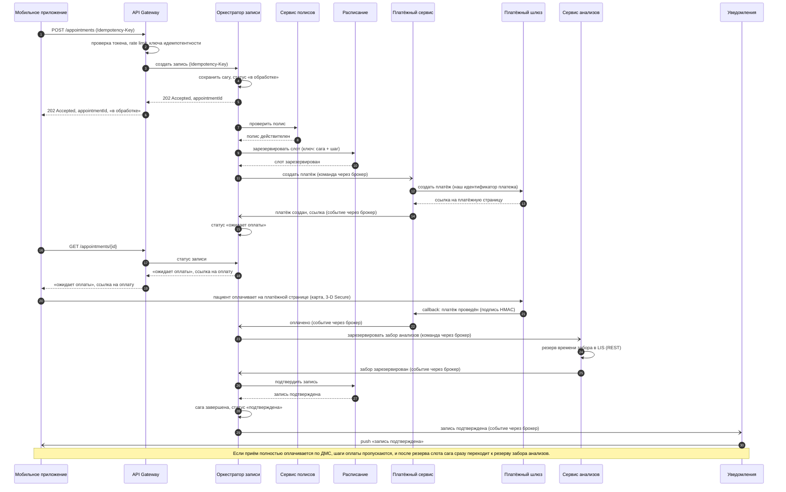

```mermaid
sequenceDiagram
    autonumber
    participant A as Мобильное приложение
    participant G as API Gateway
    participant O as Оркестратор записи
    participant P as Сервис полисов
    participant S as Расписание
    participant Pay as Платёжный сервис
    participant GW as Платёжный шлюз
    participant L as Сервис анализов
    participant N as Уведомления
    A->>G: POST /appointments (Idempotency-Key)
    G->>G: проверка токена, rate limit, ключа идемпотентности
    G->>O: создать запись (Idempotency-Key)
    O->>O: сохранить сагу, статус «в обработке»
    O-->>G: 202 Accepted, appointmentId
    G-->>A: 202 Accepted, appointmentId, «в обработке»
    O->>P: проверить полис
    P-->>O: полис действителен
    O->>S: зарезервировать слот (ключ: сага + шаг)
    S-->>O: слот зарезервирован
    O-)Pay: создать платёж (команда через брокер)
    Pay->>GW: создать платёж (наш идентификатор платежа)
    GW-->>Pay: ссылка на платёжную страницу
    Pay-)O: платёж создан, ссылка (событие через брокер)
    O->>O: статус «ожидает оплаты»
    A->>G: GET /appointments/{id}
    G->>O: статус записи
    O-->>G: «ожидает оплаты», ссылка на оплату
    G-->>A: «ожидает оплаты», ссылка на оплату
    A->>GW: пациент оплачивает на платёжной странице (карта, 3-D Secure)
    GW->>Pay: callback: платёж проведён (подпись HMAC)
    Pay-)O: оплачено (событие через брокер)
    O-)L: зарезервировать забор анализов (команда через брокер)
    L->>L: резерв времени забора в LIS (REST)
    L-)O: забор зарезервирован (событие через брокер)
    O->>S: подтвердить запись
    S-->>O: запись подтверждена
    O->>O: сага завершена, статус «подтверждена»
    O-)N: запись подтверждена (событие через брокер)
    N-)A: push «запись подтверждена»
    Note over A,N: Если приём полностью оплачивается по ДМС, шаги оплаты пропускаются, и после резерва слота сага сразу переходит к резерву забора анализов.
```
