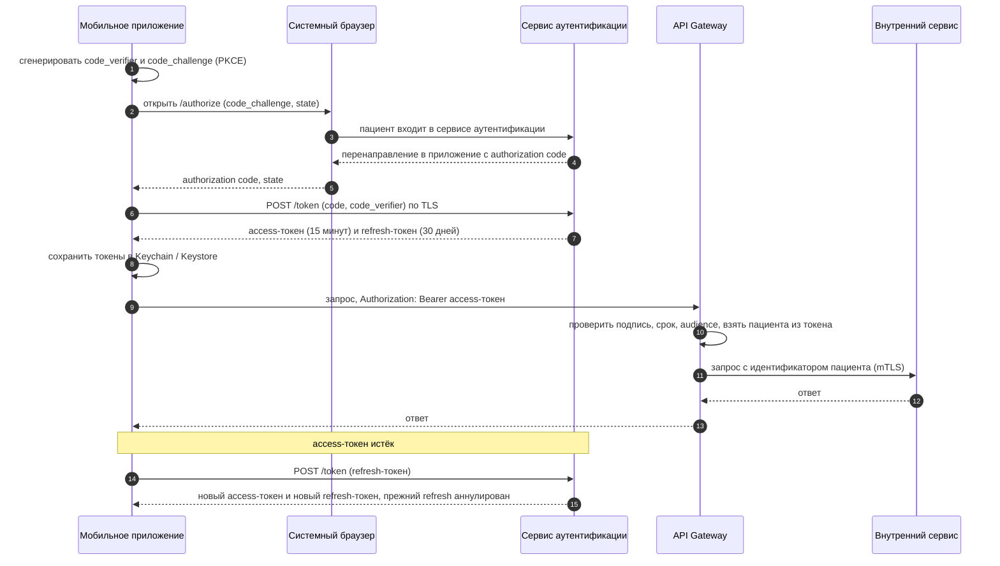

```mermaid
sequenceDiagram
    autonumber
    participant A as Мобильное приложение
    participant B as Системный браузер
    participant I as Сервис аутентификации
    participant G as API Gateway
    participant S as Внутренний сервис
    A->>A: сгенерировать code_verifier и code_challenge (PKCE)
    A->>B: открыть /authorize (code_challenge, state)
    B->>I: пациент входит в сервисе аутентификации
    I-->>B: перенаправление в приложение с authorization code
    B-->>A: authorization code, state
    A->>I: POST /token (code, code_verifier) по TLS
    I-->>A: access-токен (15 минут) и refresh-токен (30 дней)
    A->>A: сохранить токены в Keychain / Keystore
    A->>G: запрос, Authorization: Bearer access-токен
    G->>G: проверить подпись, срок, audience, взять пациента из токена
    G->>S: запрос с идентификатором пациента (mTLS)
    S-->>G: ответ
    G-->>A: ответ
    Note over A,I: access-токен истёк
    A->>I: POST /token (refresh-токен)
    I-->>A: новый access-токен и новый refresh-токен, прежний refresh аннулирован
```
